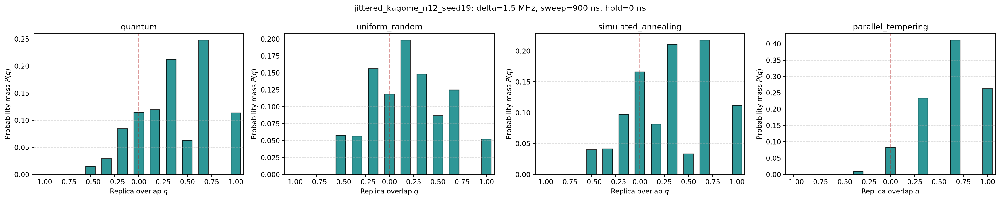
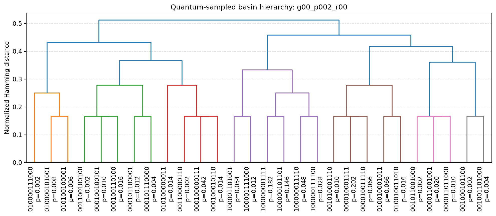
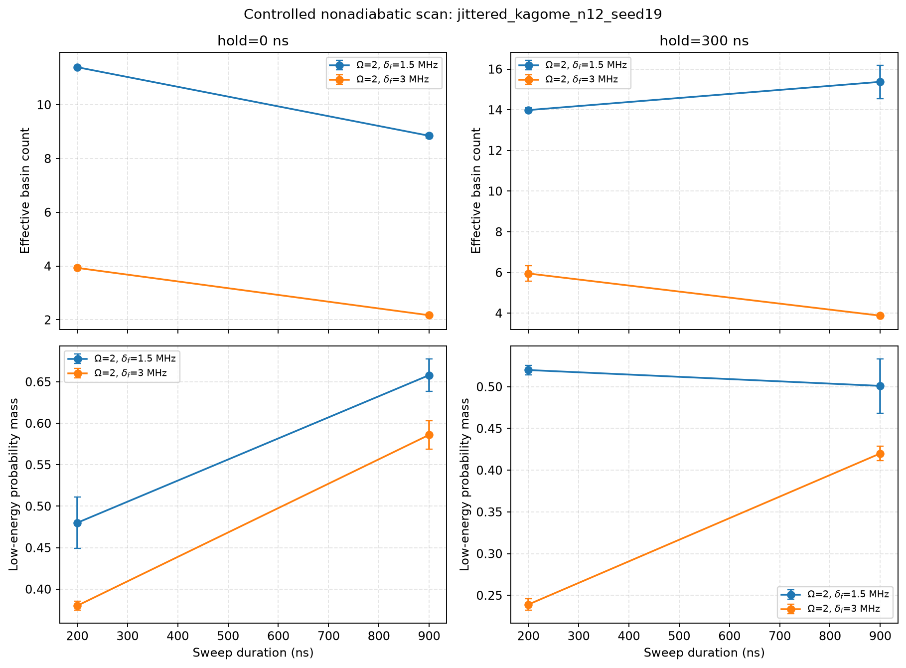

# Feasibility Proof
## Quantum-Induced Basin Sampling in Frustrated Ising Landscapes on a Neutral-Atom Processor

### 1. Purpose

This document provides technical feasibility evidence for the proposed EuroHPC Quantum Access Pilot project targeting the RUBY 100-atom neutral-atom quantum processor.

A working research prototype, **Quantum Basin Sampler v0.1.0**, has been developed to implement the proposed quantum-classical workflow. The prototype currently operates in simulation and deliberately does not claim to reproduce the final RUBY device calibration or control stack. Its purpose at this stage is to demonstrate that the complete scientific workflow—from realizable neutral-atom geometries and nonadiabatic Rydberg evolution to repeated sampling, classical basin identification, and quantitative comparison with classical algorithms—can be executed reproducibly.

---

### 2. Implemented Workflow

The prototype implements the following end-to-end pipeline:

**Neutral-atom landscape construction -> nonadiabatic Rydberg evolution -> repeated projective sampling -> deterministic basin identification -> comparison with classical exploration.**

Candidate neutral-atom geometries include triangular and Kagome patches, a square-lattice negative control, vacancy and positional disorder, and connected amorphous random-geometric arrays. The code characterizes each geometry using structural descriptors including connectivity, degree statistics, triangle counts, cycle rank, bipartiteness, and geometric or bond disorder.

For sufficiently small systems, exact classical enumeration is performed before quantum emulation. This determines local minima, exact basin volumes, and one-spin minimax barrier structure and allows disconnected, trivial, or otherwise uninformative instances to be rejected before expensive quantum simulations are performed.

---

### 3. Quantum Prototype

Nonadiabatic neutral-atom evolution is implemented using **Pulser**. The current pulse protocol uses controlled rise-sweep-hold-freeze sequences with programmable Rabi amplitude, final detuning, sweep duration, and hold duration.

Small-system dynamics are simulated using Pulser's Qutip backend. Repeated finite-shot measurements generate ensembles of classical spin configurations from the evolved quantum state.

The implementation has been exercised through:

- a **9-atom end-to-end quickstart**, and
- a **verified 12-atom coarse quantum scan**.

The configured proposal-scale emulator design supports systematic scans over pulse parameters, geometries, and independent run replicates. The present proposal configuration contains a replicated factorial design comprising **432 ideal-emulator runs** before subsequent targeted refinement.

---

### 4. Classical Controls and Basin Identification

The prototype implements four principal classical references:

- uniform random sampling,
- Metropolis-Hastings,
- simulated annealing, and
- parallel tempering.

Classical algorithms include explicit accounting of energy-difference evaluations so that computational effort can be compared using a stated resource convention.

A central feature of the implementation is that quantum-derived and classical configurations are passed through the **same deterministic one-spin descent algorithm**. This provides a common map from every sampled configuration to a classical local-energy minimum and therefore a common definition of the basins explored by each method.

This permits the project to compare not only minimum energies but the full distribution of sampled basins.

---

### 5. Implemented Analysis

The analysis pipeline currently includes:

- basin population distributions,
- basin entropy,
- effective basin count,
- low-energy probability mass,
- basin coverage,
- Hamming-distance diversity,
- spin-overlap statistics,
- distribution distances,
- hierarchical clustering and Hamming dendrograms,
- low-probability basin inspection,
- independent run replicates, and
- multinomial finite-shot bootstrap intervals.

For small landscapes, exact basin volumes and barrier merge trees provide additional ground-truth information against which the sampling methods can be evaluated.

Results are written as reproducible JSON, CSV, and graphical artifacts, including complete run-level counts, basin tables, landscape information, comparison statistics, and diagnostic plots.

---

### 6. Hardware-Facing Implementation

The prototype contains a conservative provisional RUBY-oriented device profile used to validate hardware assumptions without claiming equivalence to the deployed system.

Hardware integration work has also begun. The repository includes:

- optional **Pulser-to-myQLM/Qaptiva job conversion**,
- a **TGCC-gated RUBY submission example**, and
- a separate **Qadence program-construction example**.

The locally verified software stack uses Pulser 1.9.0, pulser-simulation 1.9.0, Pulser-myQLM 0.8.3, myQLM 1.13.6, and Qadence 1.11.5.

These components establish a concrete software path from the research prototype toward the RUBY execution environment. The conversion and construction paths have been smoke-tested locally, but no Qaptiva server or RUBY QPU was contacted.

---

### 7. Prototype Results

The results below were generated from the frozen 12-atom coarse-scan configuration committed with the repository. The representative point was selected from the predeclared grid because its exact landscape contains several low-energy basins and because it provides an informative comparison among quality and diversity objectives. It was not selected as evidence of quantum advantage.

#### 7.1 Verified Emulator Experiment

**Configuration**

- System size: **N = 12 atoms**
- Geometry: **jittered Kagome (bond-disordered Kagome)**
- Geometry identifier: **`jittered_kagome_n12_seed19`**
- Quantum backend: **Pulser `QutipBackendV2`, ideal state-vector emulation**
- Number of quantum shots: **500 per replicate (1,000 across two replicates at the representative point)**
- Number of independent replicates: **2**
- Pulse protocol: **rise-sweep-hold-freeze**
- Rabi amplitude: **\(\Omega/(2\pi) = 2.0\) MHz**
- Initial detuning: **\(\delta_i/(2\pi) = -6.0\) MHz**
- Final detuning: **\(\delta_f/(2\pi) = 1.5\) MHz**
- Rise, sweep, hold, and fall durations: **300 ns, 900 ns, 0 ns, and 300 ns**, respectively
- Total programmed evolution time: **1,500 ns**
- Classical references: **uniform random, simulated annealing, and parallel tempering**
- Configuration file: **`configs/n12_coarse_scan.json`**
- Git commit containing the frozen results: **`e7e4562d0c2c7f2b211fd6e836fac76c01d00549`**

At the selected final detuning, exact enumeration of all 4,096 configurations finds **31 local minima**, of which **six** lie within the predeclared 0.25 MHz low-energy window.

#### 7.2 End-to-End Validation

The verified run successfully completed the complete workflow:

**geometry construction -> Rydberg evolution -> repeated quantum sampling -> deterministic one-spin descent -> basin identification -> classical comparison -> statistical analysis.**

No manual intervention was required between quantum sampling and basin-level analysis. A single configuration-driven command generated the exact landscape, quantum samples, classical samples, common descent mapping, bootstrap intervals, comparison tables, run-level JSON files, overlap plots, hierarchy plots, and aggregate scan plot.

#### 7.3 Representative Quantitative Results

The table reports the mean of the two independent replicates for the selected 900 ns/no-hold point. Energies are expressed in the repository's MHz convention, entropy in natural logarithm units, and Hamming diversity as the mean number of differing spins between two basin samples.

| Quantity | Quantum sampling | Random baseline | Simulated annealing | Parallel tempering |
|---|---:|---:|---:|---:|
| Best energy (MHz) | -7.2684 | -7.2684 | -7.2684 | -7.2684 |
| Low-energy probability mass | 0.658 | 0.352 | 0.652 | 0.954 |
| Distinct basins discovered | 28 | 31 | 28 | 10 |
| Effective basin count | 8.846 | 19.389 | 8.999 | 3.784 |
| Basin entropy (nats) | 2.573 | 3.152 | 2.544 | 1.670 |
| Mean Hamming diversity (spins) | 3.833 | 4.854 | 4.193 | 2.278 |
| Distinct low-energy basins discovered | 6 | 6 | 6 | 6 |
| Generation energy-difference evaluations* | N/A | 0 | 360,000 | 312,010 |
| Common-descent flip-cost evaluations | 5,310 | 24,330 | 528 | 228 |

*Classical generation effort is reported using the resource convention implemented in the prototype. Uniform random generation requires no Ising energy-difference evaluations, but it still incurs the common-descent cost shown separately. Quantum shots and classical evaluations are not presented as directly equivalent computational costs.*

#### 7.4 Basin-Distribution Comparison

For the selected instance, deterministic descent maps every measured or classically generated configuration to a common set of local minima. The resulting basin probabilities are

`P_Q(m), P_R(m), P_SA(m), P_PT(m)`,

where `m` labels a classical basin. The mean Jensen-Shannon distances over the two independent replicates are:

- quantum vs random: **0.1419 bits**; replicate range **0.1223-0.1614**;
- quantum vs simulated annealing: **0.0965 bits**; replicate range **0.0777-0.1153**; and
- quantum vs parallel tempering: **0.1986 bits**; replicate range **0.1734-0.2237**.

The reported Jensen-Shannon values use independent replicate outcomes but do not have separate bootstrap confidence intervals in the current frozen analysis. Finite-shot uncertainty was instead evaluated for the principal basin metrics using 200 multinomial bootstrap resamples per run at 95% confidence. For quantum low-energy mass, the two run-level intervals were **[0.628, 0.716]** and **[0.608, 0.684]**. For quantum effective basin count, they were **[7.751, 9.774]** and **[7.896, 9.888]**.

**Interpretation**

At this rugged point, the quantum-induced distribution places substantially more probability in the six declared low-energy basins than uniform random sampling (0.658 versus 0.352) while retaining fewer effective basins. Its low-energy mass and effective basin count closely match simulated annealing (0.652 and 8.999), whereas parallel tempering obtains higher low-energy mass (0.954) but concentrates on fewer effective basins (3.784). This establishes a reproducible, pulse-controlled quality-diversity trade-off and a measurable nonuniform sampling bias; it does not establish quantum advantage or a coherence-specific mechanism.

#### 7.5 Representative Figures

**Figure 1. Quantum and classical replica-overlap distributions**

*Empirical replica-overlap distributions for the first independent replicate of the verified 12-atom point. Each panel uses 500 samples followed by the same deterministic descent. The quantum and simulated-annealing distributions are broadly similar but not identical; uniform random sampling is more dispersed, while parallel tempering is strongly concentrated at positive overlap.*

**Figure 2. Quantum-sampled basin hierarchy**

*Hamming-distance dendrogram of the 28 basins reached by the quantum emulator in the first independent replicate. Leaf labels give the basin bitstring and empirical probability. Branch height is normalized Hamming distance, so basins merging at small height differ by relatively few spins. This is a sampled structural hierarchy, not an energy-barrier tree.*

**Figure 3. Controlled nonadiabatic parameter scan**

*Replicate-mean effective basin count and low-energy probability mass across final detuning, sweep duration, and hold duration. Error bars show the sample standard deviation across the two independent replicates. The 1.5 MHz rugged landscape and 3.0 MHz single-funnel control respond differently to sweep and hold, demonstrating that the workflow resolves controlled changes in the quality-diversity balance.*

#### 7.6 Reproducibility Record

The reported results were generated using:

- Quantum Basin Sampler version: **0.1.0**
- Git commit containing the results: **`e7e4562d0c2c7f2b211fd6e836fac76c01d00549`**
- Configuration file: **`configs/n12_coarse_scan.json`**
- Random-seed policy: **base seed `20260830`; deterministic SHA-256-derived 32-bit seeds for each run, method, replicate, and descent/bootstrap stage**
- Pulser version: **1.9.0**
- pulser-simulation version: **1.9.0**
- Pulser-myQLM version: **0.8.3**
- myQLM version: **1.13.6**
- Qadence version: **1.11.5**
- Python version: **3.12.13**
- Execution environment: **64-bit Linux 6.12, x86-64, 11th Gen Intel Core i3-1115G4 CPU; ideal local CPU emulation**

Associated machine-readable outputs:

- `summary.csv`: **`results/n12_coarse_scan/summary.csv`**
- `comparisons.csv`: **`results/n12_coarse_scan/comparisons.csv`**
- run-level JSON: **`results/n12_coarse_scan/runs/`**
- landscape analysis: **`results/n12_coarse_scan/landscapes/`**
- figures: **`results/n12_coarse_scan/plots/`**

These artifacts are versioned in the repository at the identified commit. The repository must be made reviewer-accessible before proposal submission.

---

### 8. Resource and Execution Planning

The prototype contains an explicit proposal resource-inventory tool. The current science-and-control design contains approximately **1,042,000 planned measurement shots**, to be submitted in batches according to the final Hosting Entity limits and accounting rules.

Expensive quantum-emulator calculations are deliberately staged. Candidate geometries are first screened using structural and exact classical analysis, followed by small-system coarse quantum scans. Further computation is committed only to regions exhibiting reproducible and scientifically informative behavior. Noise and dephasing controls are planned after this initial selection rather than exhaustively across the full parameter space.

This staged workflow is designed to minimize unnecessary emulator and QPU usage.

---

### 9. Current Limitations and Work Before Hardware Execution

The present prototype runs simulations only and does not claim to reproduce the final RUBY control stack, calibration, or device-specific operational constraints.

Before execution on physical hardware, the following steps remain:

1. replace provisional RUBY assumptions with the deployed device description;
2. validate permitted atomic geometries and pulse parameter ranges;
3. execute the Hosting Entity emulator benchmark;
4. validate authenticated Qaptiva/Qadence submission and result-retrieval interfaces;
5. determine supported shot batching and QPU-hour accounting;
6. introduce appropriate hardware-noise and dephasing controls; and
7. select the final geometries and pulse regions for hardware experiments.

These are primarily **device-integration and qualification tasks**, rather than missing components of the scientific workflow.

---

### 10. Feasibility Conclusion

The current emulator benchmark demonstrates the principal components required for the proposed study: construction and screening of frustrated neutral-atom landscapes, controlled nonadiabatic Rydberg evolution, repeated quantum sampling, classical reference algorithms, common deterministic basin identification, basin-resolved statistical analysis, reproducible experiment artifacts, and an initial path toward the RUBY software environment.

The feasibility evidence therefore supports the proposed project at the **emulator-benchmark and prototype-implementation levels**. The remaining work is the expected transition from a validated research prototype to the deployed RUBY environment through Hosting Entity emulator qualification, device-specific parameter validation, and hardware execution.

**Code:** Quantum Basin Sampler v0.1.0  
**Quantum software:** Pulser, Pulser-myQLM, Qadence, myQLM/Qaptiva  
**Current validation:** 9-atom end-to-end workflow; verified 12-atom coarse scan  
**Target platform:** EuroHPC RUBY 100-atom neutral-atom quantum processor

**Repository:** https://github.com/Feyusa/quantum-basin-sampler  
**Frozen results commit:** https://github.com/Feyusa/quantum-basin-sampler/commit/e7e4562d0c2c7f2b211fd6e836fac76c01d00549
